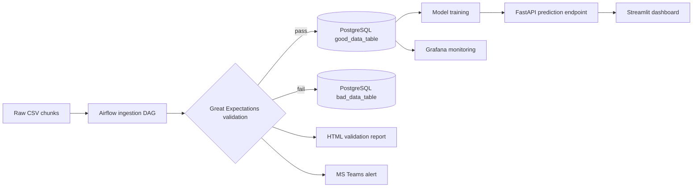

# 💧 Water Quality Prediction — ML Pipeline Project

**End-to-end MLOps pipeline: ingestion → validation → modeling → serving → monitoring.**

---

## 📊 Overview

This project builds a production-style machine learning pipeline for water quality prediction:

- **Data ingestion** scheduled with **Apache Airflow**
- **Data validation** with **Great Expectations**
- **Storage** in **PostgreSQL**
- **Model serving** via **FastAPI**
- **Interactive UI** with **Streamlit**
- **Monitoring dashboards** with **Grafana**

## 📊 Results

The pipeline's prediction model achieves **91% accuracy** on held-out sensor data.

## 🔄 Pipeline Architecture



## 📁 Project Structure

| Folder | Description |
|---|---|
| Data_Process/ | EDA and preprocessing notebook |
| Ml_model.py | Trains the model, saves water_quality_model.pkl |
| fast_api/ | FastAPI service: save/fetch predictions in PostgreSQL |
| streamlit/ | Streamlit dashboard: single, batch, and past predictions |
| setup.sql | Database schema (predictions table) |

## ✅ Ingestion & Validation

Data ingestion (Airflow) and data validation (Great Expectations) were run in the course VM environment; this repository contains the reusable pipeline code — preprocessing, model training, API, dashboard, and database schema.

## 🚀 Getting Started

```bash
# 1. Virtual environment
python3 -m venv airflow_ml && source airflow_ml/bin/activate

# 2. Install dependencies
pip install -r requirements.txt

# 3. Set your database credentials (never hardcode them!)
export DB_USER=your_user
export DB_PASSWORD=your_password
export DB_HOST=localhost
export DB_PORT=5432
export DB_NAME=ml_pipeline_db

# 4. Create the database and table
createdb aqua
psql -d aqua -f setup.sql

# 5. Train the model (requires cleaned_data.csv from the notebook)
python Ml_model.py

# 6. Start the API and UI (from the repo root)
uvicorn fast_api.fast_api:app --reload
streamlit run streamlit/streamlit_app.py
```

> ⚠️ **Security note:** database credentials should always come from environment variables or a `.env` file (added to `.gitignore`) — never hardcoded in scripts or committed files.

## 🛠 Tech Stack

| Component | Tool |
|---|---|
| Orchestration | Apache Airflow |
| Validation | Great Expectations |
| Database | PostgreSQL |
| Serving | FastAPI |
| UI | Streamlit |
| Monitoring | Grafana |

---
📅 **Last Updated:** October 2025
