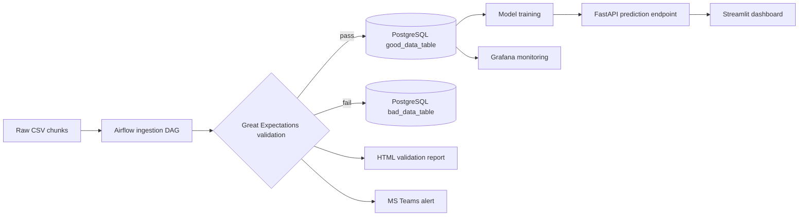

# 💧 Water Quality Prediction — ML Pipeline Project

**End-to-end MLOps pipeline: ingestion → validation → modeling → serving → monitoring.**

---

## 📊 Overview

This project builds a production-style machine learning pipeline for water quality prediction:

- **Data ingestion** scheduled with **Apache Airflow**
- **Data validation** with **Great Expectations**
- **Storage** in **PostgreSQL**
- **Model serving** via **FastAPI**
- **Interactive UI** with **Streamlit**
- **Monitoring dashboards** with **Grafana**

## 📊 Results

The pipeline's prediction model achieves **91% accuracy** on held-out sensor data.

## 🔄 Pipeline Architecture



## 📁 Project Structure

| Folder | Description |
|---|---|
| `airflow/` | DAGs (`ingestion_dag.py`), ingestion scripts, HTML validation reports |
| `data/` | Raw chunks, `good_data/`, `bad_data/` |
| `fastapi_app/` | FastAPI prediction backend |
| `streamlit_app/` | Streamlit frontend dashboard |
| `notebooks/` | EDA and experiments |

## ✅ Ingestion DAG

The DAG (`airflow/dags/ingestion_dag.py`) handles:

- Reading CSV chunks from `data/ingestion/raw_data_chunks`
- Validating with **Great Expectations**
- Routing good/bad data into separate PostgreSQL tables (`good_data_table`, `bad_data_table`)
- Generating HTML validation reports
- Sending MS Teams alerts via webhook

## 🚀 Getting Started

```bash
# 1. Virtual environment
python3 -m venv airflow_ml && source airflow_ml/bin/activate

# 2. Install dependencies
pip install -r requirements.txt

# 3. Set your database credentials (never hardcode them!)
export DB_USER=your_user
export DB_PASSWORD=your_password
export DB_HOST=localhost
export DB_PORT=5432
export DB_NAME=ml_pipeline_db

# 4. Initialize and start Airflow
airflow db init
airflow webserver --port 8080   # terminal 1
airflow scheduler               # terminal 2

# 5. Start the API and UI
cd fastapi_app && uvicorn main:app --reload
cd streamlit_app && streamlit run app.py
```

> ⚠️ **Security note:** database credentials should always come from environment variables or a `.env` file (added to `.gitignore`) — never hardcoded in scripts or committed files.

## 🛠 Tech Stack

| Component | Tool |
|---|---|
| Orchestration | Apache Airflow |
| Validation | Great Expectations |
| Database | PostgreSQL |
| Serving | FastAPI |
| UI | Streamlit |
| Monitoring | Grafana |

---
📅 **Last Updated:** October 2025
